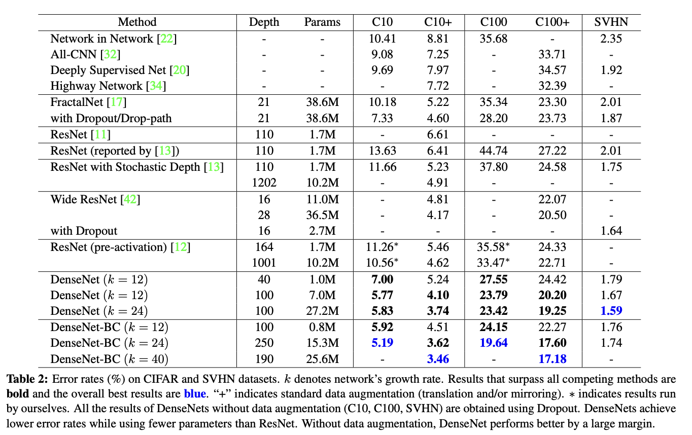
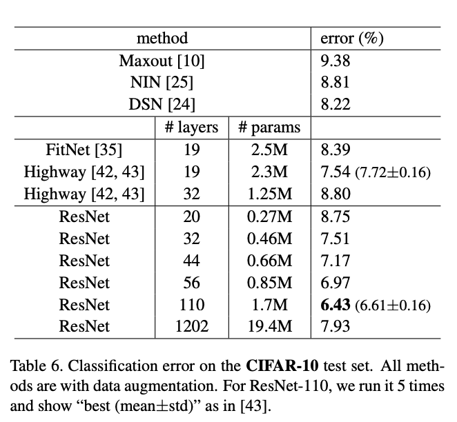

# General Library for Experimenting Computer Vision

[Colab Notebook](https://colab.research.google.com/drive/1w5uEuyaX11vndVqPy5miFg8FOT892Ju1#scrollTo=YP1RRHgp1JO7)

Prior libraries for image classification, hyperparameter tuning, report creation, etc..

### DenseNet

`python main.py --epochs 300 --batch-size 64 --learning-rate 0.1 --model DenseNet3 --dataset cifar_10 --use-wandb`

[Paper](https://arxiv.org/pdf/1608.06993.pdf)

| Method (C10+)| Original | Ours |
| ------ | -------- | ---- |
| ResNet | 6.61 | ---- |
| DenseNet (k-12) (d-40) | 5.24 | 5.6[R1](https://wandb.ai/joeljosephjin/torch-cnn/runs/8rw76l3r) |
| DenseNet-BC (k-12) (d-100) | 4.51 | ---- |
| DenseNet-BC (k-40) (d-190) | 3.46 | ----[R1](https://wandb.ai/joeljosephjin/torch-cnn/runs/dfmeizib) |

### ResNet

[Paper](https://arxiv.org/pdf/1512.03385.pdf)

### formats

Dataloader: should be of same specific format as loading inbuilt mnist or cifar

### fundamental questions?

1.Does hyperparameter tuning on small portion of the dataset generalize to the big dataset?

2.What optimizers are useful for which datasets? Does one have more stability than other?

3.Benefits of fine-tuning on pre-trained models

4.Reproduce results of research papers and do ablation studies on them. :star:

5.try on new research datasets

### prior work

Prior libraries don’t do work on this simple level. Our library will especially help beginners dive into computer vision model building, training and research.

DenseNet Pytorch Implementation by andreasveit - [Github](https://github.com/andreasveit/densenet-pytorch)

### code structure

^baseline
- main.py (train and test loop, hyperparameters, etc..)
- 

^future:
- train.py (will contain training loop function)
- test.py (will contain testing loop function)

### future work

- remove config.py (done)
- add option to select model (done)
- add mnist as a dataset option (done)
- use config for selecting the model (done)
- add more datasets? (later)
- reproduce a research paper results (in progress)
- code densenet from scratch from the paper and tensorflow implementations if needed (in progress)
- add readymade densenet to pipeline (done)
- investigate what makes densenet better and how i can find this phenomenon with less summative running time (to do)
- can another regular model with comparable number of parameters give same effect? How much is the effect of their special system (to do)
- remove usage pipeline.py file (done)
- add save and load feature (done)
- add resume from checkpoint (done)
- fix the optimizer load bug (done)
- add time as a log (done)
- replicate another repo and its 93% accuracy (done)
- start using wandb to record and compare model performances (done)
- save models to wandb (to do)
- add the use of random seeds (done)
- try add siamese classification experiments also (done)
- add test accuracy setup in siamese experiment (done)
- add class selective dataloader for fewshot experiments (done)
- add zero shot testing module for siamese-fewshot model (done)
- fix bugs in zeroshot (done)
- add few shot testing module for siamese-fewshot model (in progress-later)
- record some basic experiments using wandb (done)
- print the number of parameters (done)
- get 93% accuracy on ResNet ()
- add resume from chkpt using wandb (to do)
- fix the mistakes of 1. not using cudnn.benchmark and 2. not using model.test before the testing loop. (done)
- now getting accuracy of 94.7% (nice) - [WandB_Run1](https://wandb.ai/joeljosephjin/torch-cnn/runs/9nvzj94w) [WandB_Run2](https://wandb.ai/joeljosephjin/torch-cnn/runs/8rw76l3r)
- investigate the issue of identical dataloaders giving different results:
    - is there really a difference?::: yes, 0.3% difference exists
    - make code to characterize (done)::: found a difference in total sum
    - trying worker=1, to achieve higher accuracy (done)::: failed; still gives the lower acuracy
    - try to find the difference again more intensively
    - try shuffle=true for testset (in progress)
    - what accuracy does the other dataloader give? - [WandB_Run1](https://wandb.ai/joeljosephjin/torch-cnn/runs/bgudxnzh) [WandB_Run2](https://wandb.ai/joeljosephjin/torch-cnn/runs/hey8gslx)
- run densenet3_k12 - [WandB_Run1](https://wandb.ai/joeljosephjin/torch-cnn/runs/vwk58r4j) (failed) this is depth=12
    - run properly again - k40_d190 - [WandB_Run1](https://wandb.ai/joeljosephjin/torch-cnn/runs/dfmeizib) - failed - too much for gpu vram
    - run on kaggle [notebook](https://www.kaggle.com/joeljosephjin/run-torch-playground/edit)

